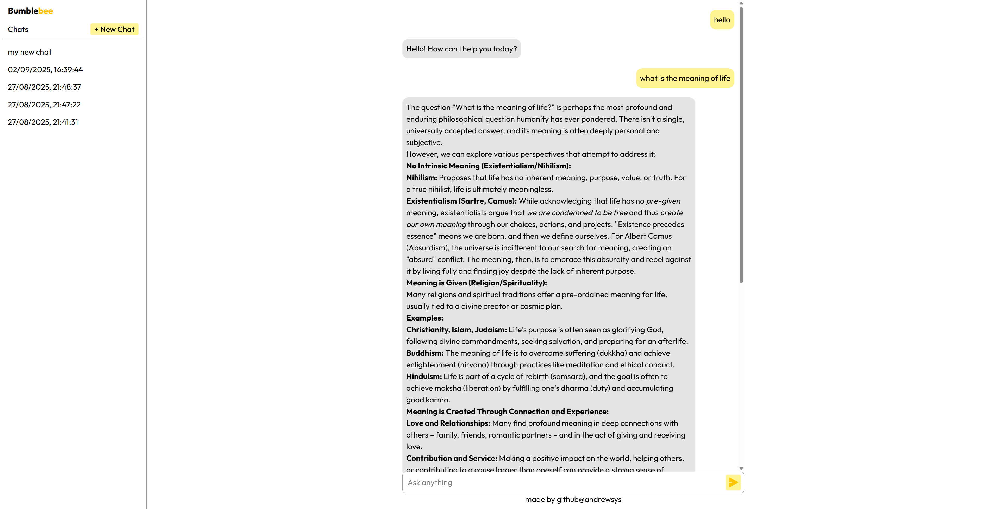

<h1 align="center" style="font-weight: bold;">Bumblebee Chatbot 🐝</h1>

<p align="center">
 <a href="#tech">Technologies</a> • 
 <a href="#started">Getting Started</a> 
</p>

<p align="center">
    <b>Bumblebee Chatbot is a simple web chat application that features a clean interface for chatting and managing conversations.</b>
</p>

<p align="center">
    Visit this Project at <a href="https://bumblebee-chatbot.vercel.app/">https://bumblebee-chatbot.vercel.app/</a>
</p>

<h2 id="layout">🎨 Layout</h2>

<p align="center">
    
</p>

<h2 id="technologies">💻 Technologies</h2>

- React
- Vite
- Typescript
- Tailwind CSS

<h2 id="started">🚀 Getting started</h2>

<h3>Prerequisites</h3>

- [NodeJS](https://github.com/)
- [Git 2](https://github.com)

<h3>Cloning</h3>

```bash
git clone https://github.com/andrewsys/bumblebee-chatbot.git
```

<h3>Starting</h3>

```bash
cd bumblebee-chatbot
npm install
npm run dev
```